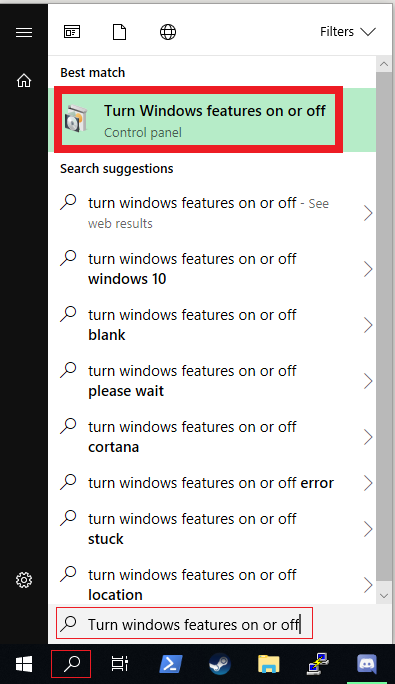
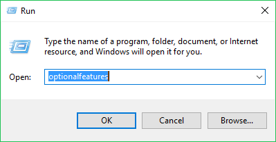
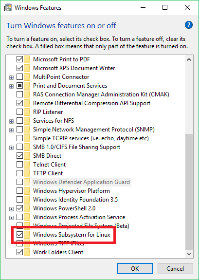
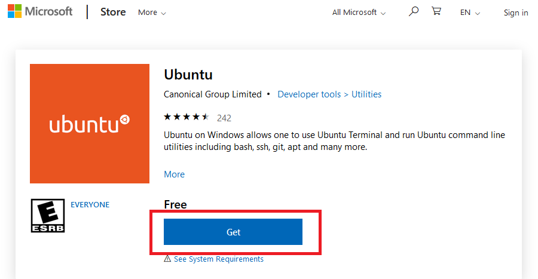
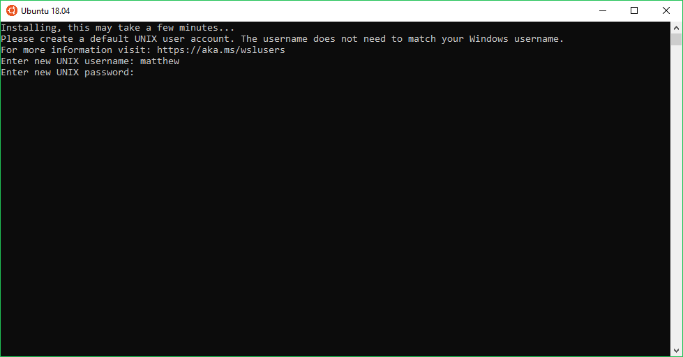
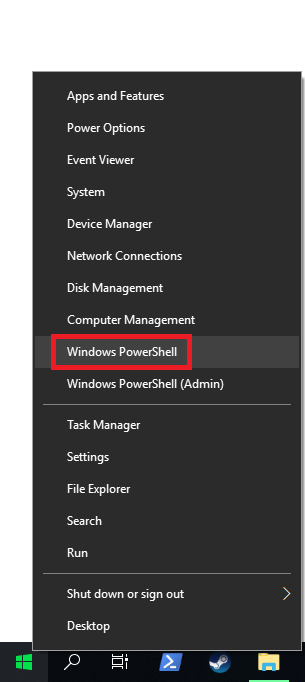
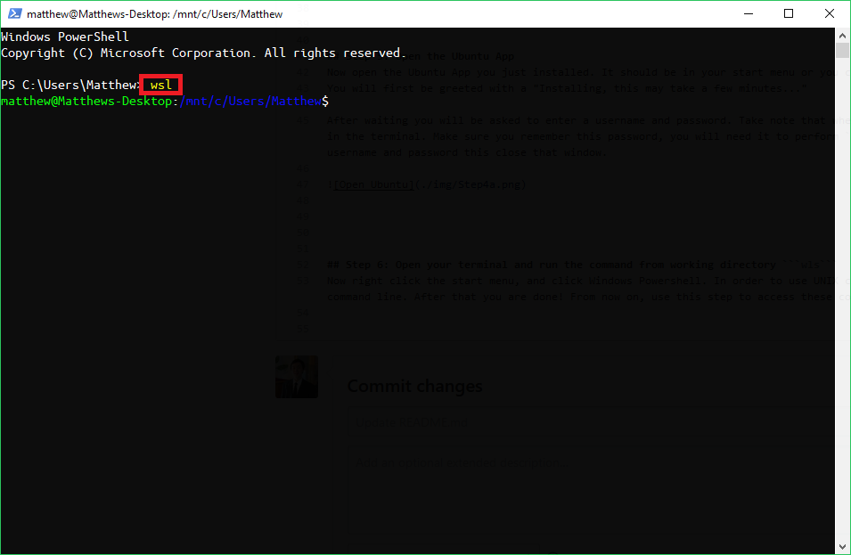

# Setting up Windows Subsystem for Linux on Windows 10
If you have MacOS or a Linux Distribution on your computer, you don't need to worry about this. You can already run UNIX commands. But if you have Windows installed here is a short-term solution to your problem. This does not replace a full Linux System. It would be a good idea to look into [Dual-Booting](https://hackernoon.com/installing-ubuntu-18-04-along-with-windows-10-dual-boot-installation-for-deep-learning-f4cd91b58557). If you want a nicer looking terminal for Windows, try [Cmder](http://cmder.net/) 

> Pre-Requisites: Windows 10


## Step 1: Open Control Panel - Turn On or Off Windows Features
First thing we want to do is to open the control panel window "Turn On or Off Windows Features".
You can either use the search menu and search "Turn On or Off Windows Features"




**OR**

You can press **Win + R**(Run) and type in "optionalfeatures"




<br/><br/><br/>
## Step 2: Turn on Windows Subsystem for Linux
Now you want to scroll down an enable "Windows Subsystem for Linux"




***
<br/><br/><br/>
## Step 3: Install the Ubuntu app from the Windows 10 Store
- **Ubuntu in the Windows 10 Store**: [Link](https://www.microsoft.com/en-us/p/ubuntu/9nblggh4msv6)

If the link above doesn't work, you want to open your Windows 10 store and install "Ubuntu". It should be the first thing that pops up in the search bar. 




<br/><br/><br/>
## Step 4: Restart your computer


<br/><br/><br/>
## Step 5: Open the Ubuntu App
Now open the Ubuntu App you just installed. It should be in your start menu or you can search "Ubuntu" with the search feature.
You will first be greeted with a "Installing, this may take a few minutes..." message.

After waiting you will be asked to enter a username and password. Take note that when typing in your password, it is *not* shown in the terminal. Make sure you remember this password, as you will need it to perform ```sudo``` commands. After entering your username and password this close that window.




<br/><br/><br/>
## Step 6: Open your terminal and run the command from working directory ```wls```
Now right click the start menu, and click Windows Powershell. 



In order to use UNIX commands, you type in ```wsl``` in the command line. After that you are done! From now on, use this step to access UNIX commands.




